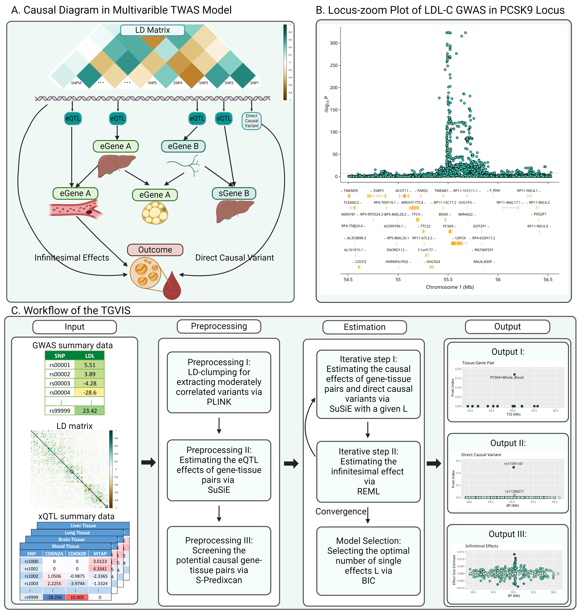

```{r setup, include=FALSE}
knitr::opts_chunk$set(echo = TRUE)
```



# Model Introduction 

We assume that a set of xQTLs influence the products of genes (e.g., expressions and splicing events) at a locus.

In the gene and tissue co-regulation network, certain gene-tissue pairs directly influence a trait without mediation by other gene-tissue pairs, which are referred to as causal gene-tissue pairs.

Some genetic variants may directly influence a trait, which are called direct causal variants in TWAS and horizontal pleiotropy in cis-MR, respectively.

A polygenic architecture of genetic effects is also considered, wherein, aside from the direct causal variants with relatively large effects, the genetic variants have infinitesimal effects that are modeled through a normal distribution with mean zero and small variance.

# Method Overview

Tissue-Gene pair, direct causal Variants, and Infinitesimal effect Selector (TGVIS) is a multivariable TWAS method that can identify causal gene-tissue pairs and direct causal variants while incorporating infinitesimal effects.

Methodologically, TGVIS employs sum of single effect (SuSiE) for fine-mapping causal gene-tissue pairs and direct causal variants, and uses restricted maximum likelihood (REML) to estimate the infinitesimal effects.

For variables such as gene-tissue pairs or direct causal variants, TGVIS uses the posterior inclusion probability (PIP) to evaluate the significance level, and employs the Pratt index to measure predictive importance.

# Installation

You can install the development version of TGVIS from GitHub using the `devtools` package:
```
devtools::install_github("harryyiheyang/TGVIS")
```

# Function usage

The function usage are illustrated as follows:
```
tgvis=function(by,bXest,LD,Noutcome,L.causal.vec=c(1:8),
               max.iter=50,max.eps=1e-3,
               inner.iter=50,pip.thres.cred=0.95,
               varinf.upper.boundary=0.25,varinf.lower.boundary=0.01,
               ebic.beta=1,ebic.upsilon=1,pip.min=0.05,
               pv.thres=0.05,pleiotropy.rm=NULL)
```
The most important inputs in the first lines are:
```
by: A vector of Z-scores of the marginal effects from the outcome GWAS.

bXest: A matrix of direct effect estimates based on the Z-scores of tissue-gene pairs.

LD: The LD matrix of variants.

Noutcome: The sample size of the outcome GWAS.

L.causal.vec: A vector of candidate numbers of single effects used in BIC.
```
Note that `bXest` is the matrix of direct eQTL effect estimates, which can be yielded by SuSiE. The concrete estimation procedure used in our data analysis is shown in Tutorial.

Other optional parameters with robust default choices include:
```
max.iter: The maximum number of iterations for the profile-likelihood algorithm. 

max.eps: The convergence tolerance for the profile-likelihood algorithm. 

susie.iter: The maximum number of iterations for `susie_rss` 
            within the profile-likelihood algorithm. 
            
pip.thres.cred: The cumulative PIP threshold for variables in a credible set. 

varinf.upper.boundary: The upper boundary for the prior variance of infinitesimal effects, 
                       multiplied by var(y) to adapt to different locus variances. 
                       
varinf.lower.boundary: The lower boundary for the prior variance of infinitesimal effects, 
                       not multiplied by var(y).
                       
ebic.beta: The extended BIC factor for causal effects of tissue-gene pairs 
           and direct causal variants used in BIC computation. 
           
ebic.upsilon: The extended BIC factor for infinitesimal effects used in BIC computation.

pip.min: The minimum PIP threshold for individual causal effects in the profile-likelihood. 
         This is used to specify which tissue-gene pairs and direct causal variants to include 
         in the score test of variance of infinitesimal effects. 
         
pv.thres: The p-value threshold for the score test. 

pleiotropy.rm: A vector of indices specifying which variants should not be considered 
               as having direct causal effects.
               
prior.weight.theta: A vector of prior weights of gene-tissue pairs, which will be used as input in                     SuSiE. Default is rep(1/p,p) where p is the number of gene-tissue pairs. A                        proper weights could improve the calibration of SuSiE.

prior.weight.gamma: A vector of prior weights of direct causal variants, which will be used as                        input in SuSiE. Default is rep(1/m,m) where m is the number of direct causal                      variant. A proper weights could improve the calibration of SuSiE.
```

The output of `TGVIS` includes
```
theta: the causal effect estimates of gene-tissue pairs

theta.pip: the individual PIPs of causal effect estimate of gene-tissue pairs

theta.pratt: the individual Pratt indices of causal effect estimate of gene-tissue pairs

gamma: the direct causal effects of variants 

gamma.pip: the individual PIPs of direct causal effects of variants 

gamma.pratt: the individual Pratt indices of direct causal effects of variants 

upsilon: the predicted infinitesimal effects

```
There are more outputs in our functions. Please see the details in function. 

# Tutorial

We also provide a real locus data analysis code and data.  
The data can be downloaded from [example-data.zip](https://www.dropbox.com/scl/fi/gyhk6brugu5j5b89v1yjy/TGVIS_Example_Data.zip?rlkey=0a5p1wzojavgui5h5954i69z7&st=pre7aepq&dl=0).  
For a step-by-step guide on how to use TGVIS for data analysis, please refer to the tutorial: [Tutorial-of-TGVIS.pdf](Tutorial of TGVIS.pdf).

# License

This package is licensed under the MIT License.

# Contact

For any questions or issues, please contact Yihe Yang at yxy1234@case.edu.
