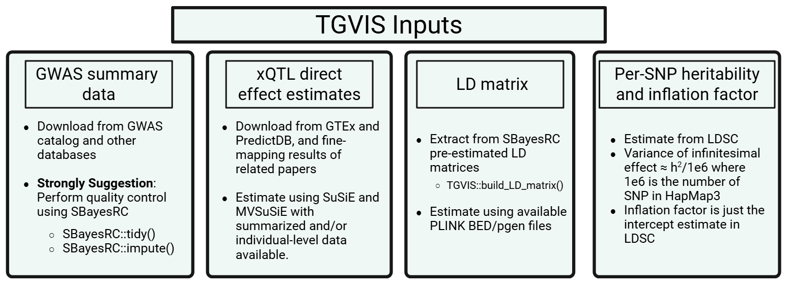

```{r, include = FALSE}
knitr::opts_chunk$set(
  collapse = TRUE,
  comment = "#>"
)
```



## Input 1: GWAS summary data for TGVIS

This section describes how to prepare GWAS summary statistics and LD reference panels for TGVIS analysis. TGVIS requires GWAS summary-level data for a single locus as its in the first input. We strongly recommend performing quality control using **SBayesRC** prior to running TGVIS. Although SBayesRC is primarily designed for polygenic prediction using functional annotations and high-density SNPs (>7 million), its two quality control functions are highly effective for preprocessing GWAS summary data.

###  Quality Control with SBayesRC

Run the following two functions sequentially:

```r
SBayesRC::tidy(mafile = "path/to/your_gwas.ma",LDdir  = "path/to/ld_folder",
               output = "output_prefix_tidy.ma",log2file = TRUE)

SBayesRC::impute(mafile = "output_prefix_tidy.ma",LDdir  = "path/to/ld_folder",
                 output = "output_prefix_imp.ma",log2file = TRUE)
```

### Input Format: GWAS Summary Statistics

The input `mafile` must follow the COJO format: 

| SNP     | A1 | A2 | freq   | b      | se     | p      | N      |
|---------|----|----|--------|--------|--------|--------|--------|
| rs1001  | A  | G  | 0.8493 | 0.0024 | 0.0055 | 0.6653 | 129850 |
| rs1002  | C  | G  | 0.0306 | 0.0034 | 0.0115 | 0.7659 | 129799 |
| rs1003  | A  | C  | 0.5128 | 0.0045 | 0.0038 | 0.2319 | 129830 |

### LD Reference Panel

The `LDdir` should contain precomputed eigen-decomposition files for each LD block. We provide links to the SBayesRC LD panels for multiple ancestries and SNP sets: [EUR](https://gctbhub.cloud.edu.au/data/SBayesRC/resources/v2.0/LD/Imputed/ukbEUR_Imputed.zip), [EAS](https://gctbhub.cloud.edu.au/data/SBayesRC/resources/v2.0/LD/Imputed/ukbEAS_Imputed.zip), and [AFR](https://gctbhub.cloud.edu.au/data/SBayesRC/resources/v2.0/LD/Imputed/ukbAFR_Imputed.zip)
 
We suggest installing this [version](https://github.com/zhilizheng/SBayesRC/commit/fac67faf7557b2e542e5cd54fd54b7bd50abb156) of SBayesRC, because in our tests, the current version is incompatible with the BH R package and cannot be installed properly.

## Input 2: xQTL direct effect sizes

The second input to TGVIS is the weights of xQTL effect size (also known as direct effects). These are not marginal effects; instead, they represent the direct causal effect of each xQTL on gene expression or splicing, estimated while accounting for the LD matrix of nearby tagged variants.

We **strongly recommend** using precomputed weights from official sources, which are generally derived from individual-level data and thus more reliable than fine-mapping from summary statistics:
 [GTEx v10 SuSiE eQTL weights](https://storage.googleapis.com/adult-gtex/bulk-qtl/v10/susie-qtl/GTEx_v10_SuSiE_eQTL.tar) and [PredictDB](https://predictdb.org/). These weights are typically estimated using fine-mapping methods such as SuSiE on individual-level genotype and expression data.

## Input 3: LD Matrix

We **strongly recommend** using the LD matrices provided by SBayesRC as input to TGVIS. We have implemented a function to construct the required LD matrix:

```r
build_LD_matrix(GWAS_Locus, ldDir = "path/to/ld_folder", snpinfo)
```

- GWAS_Locus: A data frame containing GWAS summary data for a single locus (we recommend fewer than 10,000 SNPs to avoid memory issues).

- ldDir: Path to the directory containing SBayesRC precomputed LD blocks.

- snpinfo: SNP annotation information, included in the ancestry-specific LD matrices provided by SBayesRC.


## Input 4: Per-SNP Heritability and Inflation Factor

The original TGVIS and SuSiE-inf estimate an infinitesimal effect at the current locus, with its variance estimated via REML. Motivated by works from Dr. Can Yang's group, including [MR-APSS](https://www.pnas.org/doi/10.1073/pnas.2106858119) and [XMAP](https://www.nature.com/articles/s41467-023-42614-7), we note that the variance of the infinitesimal effect can be more robustly estimated genome-wide using LDSC, rather than locus-specific estimation. Dr. Yang also pointed out that for most GWAS, the variance of Z-scores is not 1, but inflated due to uncontrolled confounders. This inflation factor is precisely the intercept estimated by LDSC.

We have developed an R package `ldscR`, which includes ancestry-specific LDSC weights derived from LD matrices prodivded by PRS-CSX ([UK Biobank](https://github.com/getian107/PRScsx)). Usage is as follows:

```r
devtools::install_github("harryyiheyang/ldscR")
ldscR::ldsc.univ(gwas = GWAS_Locus,LDSC = Hapmap3_EURLDSC,sampling.time = 0)
# setting sampling.time = 0 disables standard error estimation via blockwise bootstrap.
```
In addition, empirical observations show that total heritability typically ranges between 0.1 and 0.3 across traits. Hence, a robust default is to set: per-SNP heritability = 0.2 / 1e6 and inflation factor = 1.1 (slightly larger than 1).
